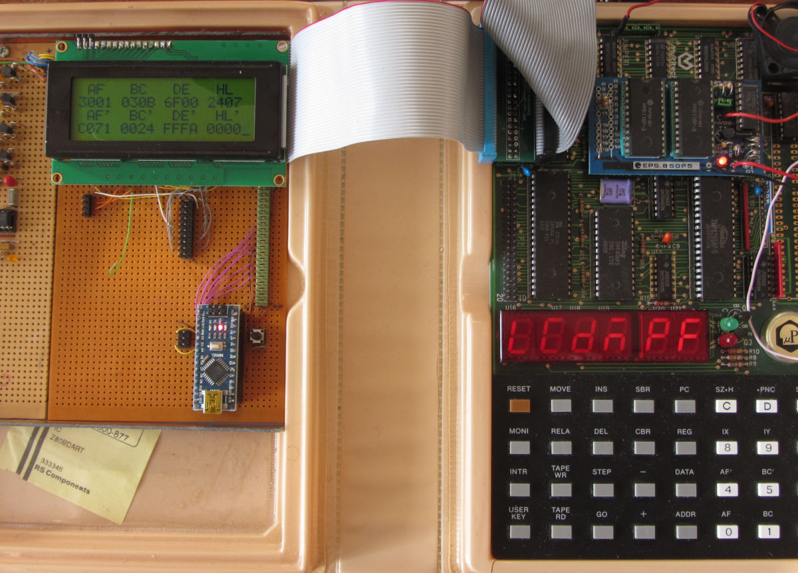

Experimental Z80 driver for HD44780U type displays

This driver uses an 8-bit data path and full read/write access, making it somewhat faster.

Currently the repository exists of an library file and a demo, used to test the library. 

The current use-case is an assistant for the single-step function in the monitor ROM. The 
keyboard allows for register inspection, but just one at a time. A jump to the demo shows 
almost all stored register values in two pages.
